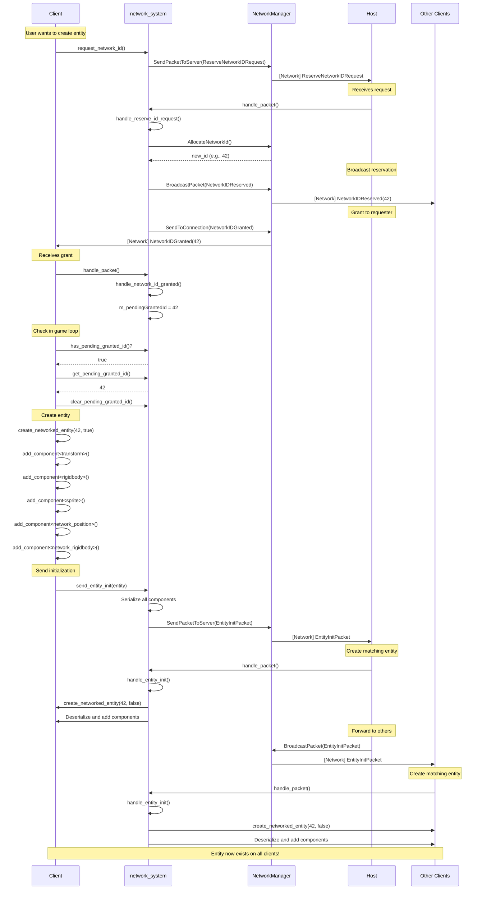
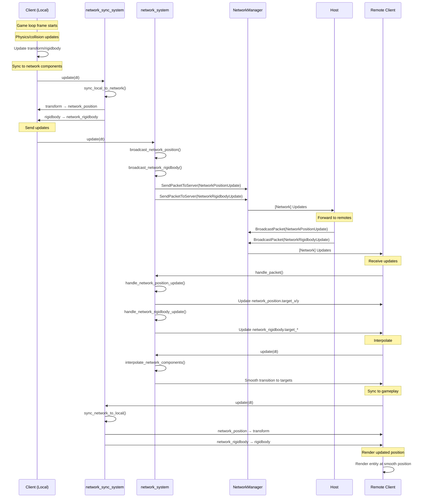
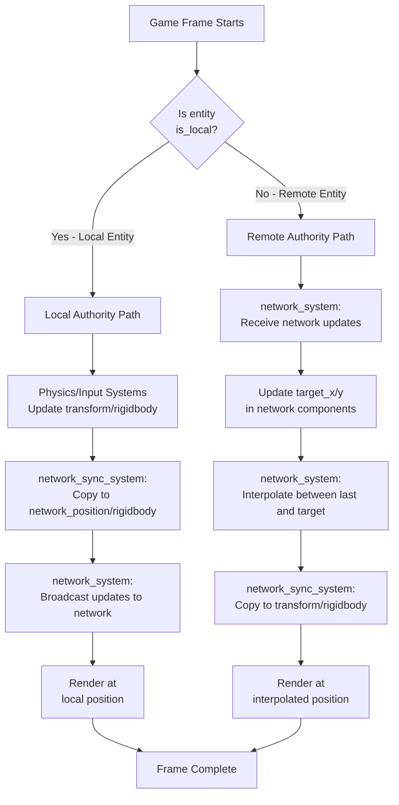
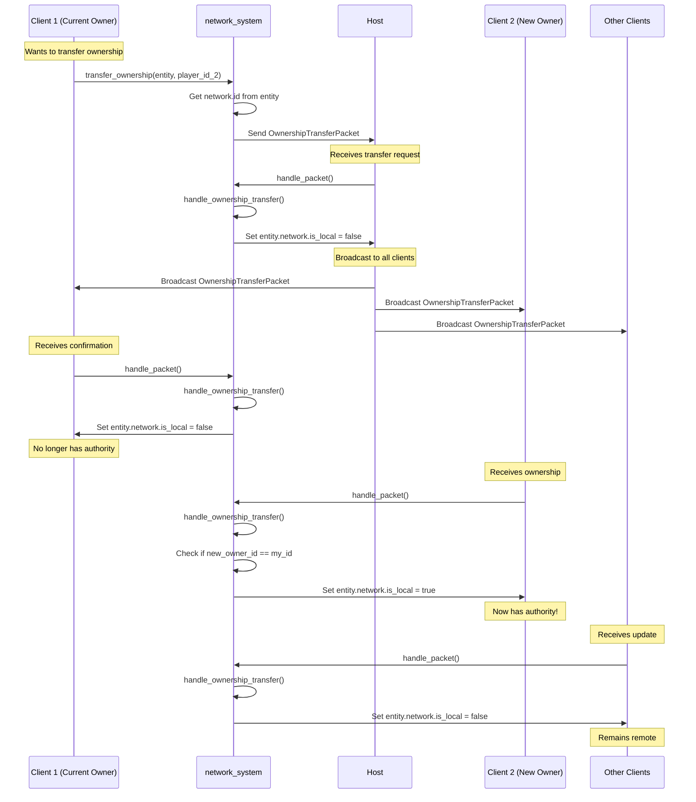
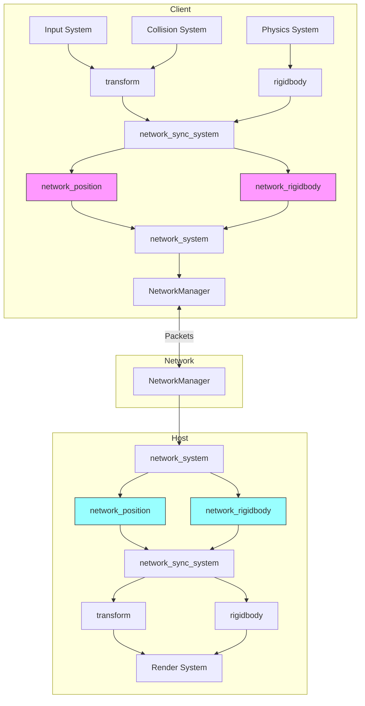

# Networked Entity Creation - Flow Diagrams

## Complete Entity Creation Flow

## Network Synchronization (Every Frame)

## Component Synchronization Flow

## Ownership Transfer Flow

## System Architecture

## Legend

- **Pink components**: Network components on local entity (sending updates)
- **Cyan components**: Network components on remote entity (receiving updates)
- **Solid arrows**: Data flow within a single machine
- **Dashed arrows**: Network communication between machines

## Key Timing Points

1. **ID Request**: Can happen anytime, typically on user action (spawn button)
2. **ID Grant**: Asynchronous, check `has_pending_granted_id()` every frame
3. **Entity Init**: Immediately after receiving ID grant
4. **Position Updates**: Every frame for local entities
5. **Interpolation**: Every frame for remote entities
6. **Sync**: Twice per frame (before and after network updates)

